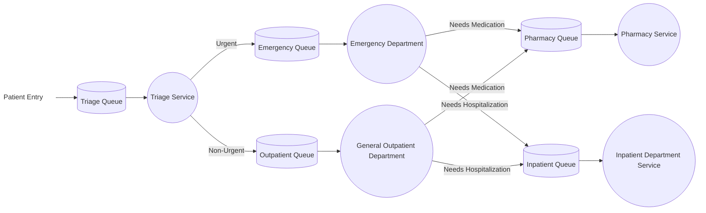
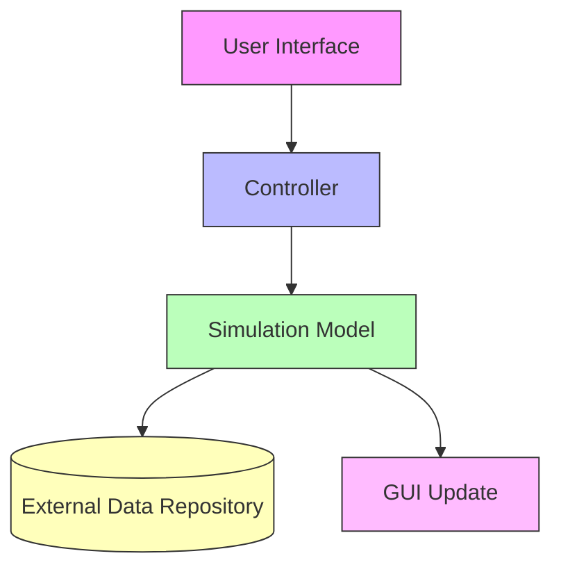

``` mermaid
flowchart LR
entry[Patient Entry] --> triage_queue[(Triage Queue)]
triage_queue --> triage((Triage Service))
triage -->|Urgent| emergency_queue[(Emergency Queue)]
triage -->|Non-Urgent| outpatient_queue[(Outpatient Queue)]

    emergency_queue --> emergency((Emergency Department))
    outpatient_queue --> outpatient((General Outpatient Department))
    
    emergency -->|Needs Medication| pharmacy_queue[(Pharmacy Queue)]
    emergency -->|Needs Hospitalization| inpatient_queue[(Inpatient Queue)]
    
    outpatient -->|Needs Medication| pharmacy_queue
    outpatient -->|Needs Hospitalization| inpatient_queue
    
    pharmacy_queue --> pharmacy((Pharmacy Service))
    inpatient_queue --> inpatient((Inpatient Department Service))
    
    style entry height:0px
    style pharmacy height:0px
    style inpatient height:0px
```

```mermaid
flowchart TD
    User[User Interface] --> Controller[Controller]
    Controller --> Model[Simulation Model]
    Model --> Database[(External Data Repository)]
    Model --> View[GUI Update]

    style User fill:#f9f,stroke:#333,stroke-width:1px
    style Controller fill:#bbf,stroke:#333,stroke-width:1px
    style Model fill:#bfb,stroke:#333,stroke-width:1px
    style Database fill:#ffb,stroke:#333,stroke-width:1px
    style View fill:#fbf,stroke:#333,stroke-width:1px
```